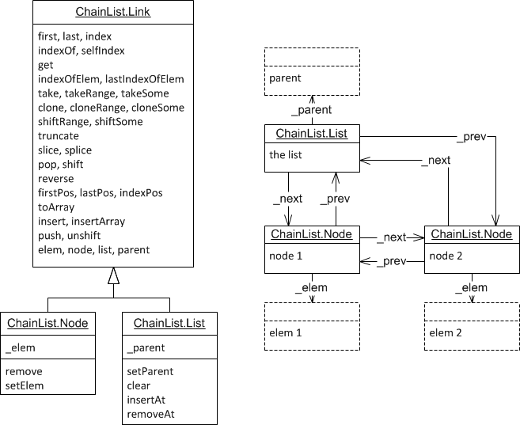

ChainList.js
==========

Use this container type when the elements needs quick access to its siblings and/or its parent container or associated parent element. Hence, its navigability is the very similar to the DOM.

It is implemented as a doubly linked list, therefore navigating n elements away takes O(n) time. Additionally, there is fast (O(1)) access to the parent list, the last element, and the element count.

Both the list (ChainList) and its nodes (ChainList.Node) inherit from ChainList.Link. 
Concrete elements can either inherit from ChainList.Node or aggregate it by passing itself as parameter (see dashed 'elem' in diagram).
Similarly, a concrete container can either inherit from ChainList or aggregate it (see dashed 'parent' in diagram).
Some functions, such as 'indexLink', 'nextLink', and 'prevLink', traverse over all links.

Also available, a sorted variant of ChainList called ChainListSorted. It does not have a unshift, push, or insertAt function. Only insert and insertArray can be used to insert elements. They will be inserted at the correct sorted location according the comparison function supplied to the constructor.

Example
-------
<pre>
var list = ChainList.fromArray([6,3,7,8])
list.get(2) == 7
var thirdNode = list.index(2)  
thirdNode.elem()== 7  
thirdNode.next().elem()==8  
thirdNode.list() == list  
</pre>
<pre>
var list2 = new ChainList();  
var elemX = {};
elemX.node = list2.insertAt(0,elemX); // also store a reference to the node from within the elem object.  
...  
elemX.node.next().elem() // travel from the item to an adjacent item
</pre>

List-only functions
-------------------
* <code>ChainList( parent )</code>  
  Constructor, where a parent aggregator can be supplied which can be accessed using 'list.parent()'.
* <code>ChainListSorted( parent, compareFunc )</code>  
  Constructor for a sorted ChainList, where the compareFunc(a,b) will determine where the element will be placed: before the first element b where the function returns a positive number.
* <code>parent ()</code>  
  Returns the parent object, or itself, if parent is null/undefined.
* <code>setParent ()</code>  
  Sets the parent object.
* <code>clear ()</code>  
  Removes all elements from the list.
* <code>count ()</code>
  Returns the amount of elements in the list (in constant time).
* <code>insertAt ( index,elem )</code>  
  Inserts at index 'index', starting from zero, the element in this list and returns the created node. Negative indices will insert backwards, where -1 will append the item.
* <code>removeAt ( index )</code>
* <code>ChainList.fromArray ( array,parent )</code>

Node-only functions
-------------------
* <code>ChainList.Node ( prev, elem *optional* )</code>
  Constructor. Adds a node after 'prev'. It will be correctly inserted in the list between the other nodes.
* <code>elem ()</code>
  Returns the element object, or itself, if the element is null/undefined.
* <code>remove ()</code>
  Removes this node from the list
* <code>setElem ( val )</code>
  Changes the element.

Common functions
-------------------
* <code>first ()</code>
* <code>last ()</code>
* <code>index ( n )</code>  
  In case link is a list, it returns the n'th node, or if n is negative, returns (count - n)'th node.
  Else, it returns n'th successor or -n'th predecessor. This list itself is never returned, not does it wrap around.
* <code>selfIndex ()</code> 
  Returns index of the node, or -1 if object is the list.
* <code>get ( n )</code>  
  In case link is a list, it returns the n'th elem, or if n is negative, returns (count - n)'th elem.
  Else, it returns n'th successor or -n'th predecessor. 
  It will not wrap around.
* <code>takeRange ( start,end )</code>
  takes and inserts a range of nodes from another list
* <code>take ( list )</code>
  takes and inserts (the rest of) another list
* <code>takeSome ( list,count )</code>
  takes and inserts certain amount of nodes.
* <code>clone ()</code>  
  Returns a copy of (the rest of) the list.
* <code>cloneRange ( end )</code>
  Creates a new list of a range of nodes.
* <code>cloneSome ( count )</code>
  Creates a new list of a certain amount of nodes.
* <code>shiftRange ( end )</code>
  Removes a range of nodes
* <code>shiftSome ( count )</code>
  Removes the certain amount of node
* <code>shift ()</code>
  Removes the current node
* <code>slice ( begin,end )</code>
  Clones a subset of nodes in a new list.
* <code>splice ( index,cutCount,elemToInsert1 )</code>
  Removes nodes and inserts elements aggregrated in new nodes, and returns the removed nodes as a list.
* <code>pop ()</code>
  Removes the last node
* <code>insert ( elem )</code>
  Inserts a single element by aggregating it in a new node.
* <code>insertArray ( elems )</code>
  InsertS multiple elements by aggregating them in new node.
* <code>unshift (elem1...)</code>  
  Inserts elems by aggregating then in new nodes, at the begin of the list
  return new length property.	
* <code>push ( elem1, ..., elemN )</code>  
  Inserts elems by aggregating then in new nodes, at the end of the list
  return new length property.
* <code>indexOf ( node )</code>
  Returns the position of the node, or -1 if it cannot be found.
* <code>indexOfElem ( elem )</code>
  Returns the position of the element, or -1 if it cannot be found.
* <code>lastIndexOfElem ( elem )</code>
* <code>indexLink ( n )</code>  
  Returns n'th successor or -n'th predecessor link. This list itself is also link that might be returned. This function wraps around.
* <code>nextLink ()</code>  
  Returns the next link, i.e. either a node or the list.
* <code>prevLink ()</code>  
  Returns the previous link, i.e. either a node or the list.
* <code>next ()</code>  
  returns the next node, or null if it was the last.
* <code>prev ()</code>  
  returns the previous link, or null if it was the first.
* <code>countRange ( end )</code>
* <code>isList ()</code>
* <code>reverse ()</code>
* <code>forEachRange ( end, func *( elem,index,Node ): retval* )</code>
* <code>forEach ( func *( elem,index,Node ): retval* )</code>
* <code>forEachBackRange ( end, func *( elem,index,Node ): retval* )</code>
* <code>forEachBack ( func *(elem,index,Node ): retval* )</code>
* <code>map ( func *( elem,index,Node ): retval* )</code>
